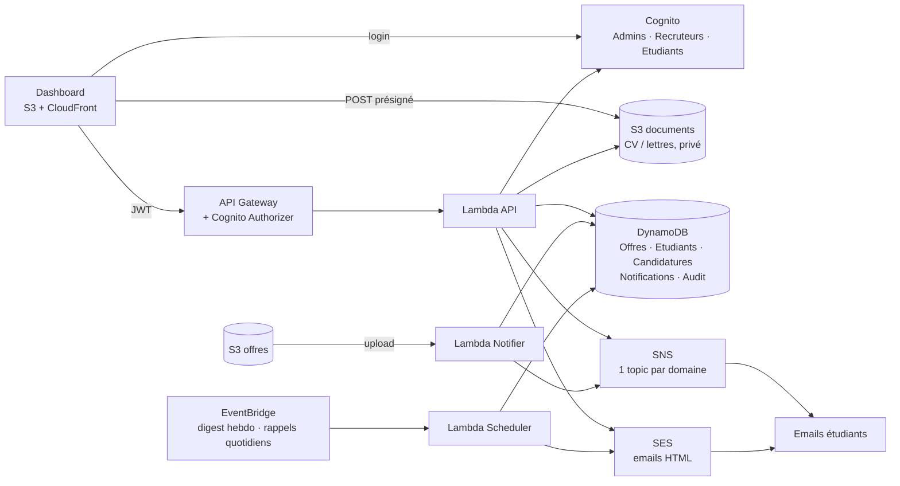

# Portail Alternance : plateforme d'alertes et de pilotage

Version « entreprise » du lab AWS (S3 → Lambda → DynamoDB → SNS) : infrastructure 100 % Terraform
en modules, API sécurisée, et un dashboard web pour les admins, les recruteurs et les étudiants.

## Ce que fait la plateforme

| Domaine | Fonctionnalités |
|---|---|
| **Offres** | Offres structurées (entreprise, lieu, rythme, durée, date limite, statut Ouverte/Clôturée), création depuis le dashboard **ou** dépôt d'un fichier dans S3, modification, clôture/réouverture, **clôture automatique** à la date limite |
| **Candidatures** | Postuler avec message + **CV et lettre** (dépôt direct dans un bucket S3 privé, 5 Mo, PDF/DOC/DOCX), pipeline **Reçue → Présélectionnée → Entretien → Acceptée / Refusée**, **email HTML à l'étudiant à chaque changement de statut**, **notes internes** (invisibles de l'étudiant) |
| **Rôles** | `Admins` (tout), `Recruteurs` (publient et gèrent **uniquement leurs offres** et leurs candidatures), `Etudiants` (consultent, postulent, gèrent leur profil) |
| **Étudiants** | Ajout unitaire, **import CSV** (accepte le format du lab), profil éditable par l'étudiant (met à jour ses abonnements), **suppression RGPD** (candidatures, documents, abonnements, compte) |
| **Notifications** | Alerte SNS ciblée par domaine, renvoi manuel, **historique des envois**, **résumé hebdomadaire** et **rappel avant date limite** (emails HTML via SES, EventBridge) |
| **Pilotage** | Recherche / filtres / tri / pagination sur tous les tableaux, export CSV des candidatures, statistiques (taux d'acceptation, délai moyen de traitement, candidatures par statut et domaine, offres sans candidature), fiche candidatures par étudiant |
| **Sécurité** | Cognito (login Hosted UI, PKCE), MFA TOTP configurable, IAM en moindre privilège (3 rôles Lambda), **journal d'audit**, isolation stricte entre étudiants et entre recruteurs |

## Architecture



## Structure

```
terraform/
  main.tf variables.tf outputs.tf providers.tf terraform.tfvars.example
  modules/
    dynamodb/      5 tables (Offres, Etudiants, Candidatures + 2 GSI, Notifications, Audit)
    sns/           1 topic par domaine
    ses/           identité expéditrice
    s3_offres/     dépôt des fichiers d'offres
    s3_documents/  CV / lettres (privé, CORS restreint, chiffré)
    s3_frontend/   site + CloudFront (OAC)
    cognito/       user pool, groupes, 1er admin, MFA
    iam/           3 rôles Lambda en moindre privilège
    lambda/        packaging + 3 fonctions (notifier, api, scheduler)
    schedules/     règles EventBridge
    api_gateway/   API REST proxy + authorizer Cognito
backend/
  lambda_api/        router + handlers (offres, étudiants, candidatures, misc) + helpers
  lambda_notifier/   déclenchée par upload S3
  lambda_scheduler/  digest hebdo, rappels, clôture auto
  tests/             24 tests pytest + moto
frontend/
  index.html login.html css/ js/ (config, auth, api, ui, app)
  tests/             tests jsdom (smoke + contrat sur les vraies réponses de l'API)
scripts/
  deploy.sh          terraform apply + config.js + upload + invalidation CloudFront
  test.sh            toutes les vérifications locales
```

## Déploiement

Prérequis : Terraform ≥ 1.5, AWS CLI configuré, `jq`.

```bash
cd terraform
cp terraform.tfvars.example terraform.tfvars   # renseigner admin_email
cd .. && ./scripts/deploy.sh
```

### Après le premier déploiement (à faire une fois)

1. **SES** : cliquez sur le lien de vérification reçu à l'adresse expéditrice (`sender_email`, par défaut `admin_email`). Sans cela, aucun email de statut / résumé / rappel ne part.
2. **Premier admin** : un email Cognito contient le mot de passe temporaire ; ouvrez l'URL `dashboard_url`.
3. **SNS** : l'admin reçoit un email de confirmation par topic ; confirmez pour recevoir les alertes.
4. **Étudiants** : chaque étudiant reçoit (a) l'invitation Cognito, (b) une confirmation SNS par domaine suivi, (c) une vérification SES tant que `ses_sandbox_mode = true`. C'est beaucoup d'emails : voir « Limites ».

### Variables utiles

| Variable | Défaut | Rôle |
|---|---|---|
| `admin_email` | (obligatoire) | premier admin + abonné aux topics |
| `sender_email` | `admin_email` | expéditeur SES |
| `mfa_configuration` | `OPTIONAL` | `ON` = MFA TOTP **obligatoire pour tous** (Cognito ne sait pas l'imposer par groupe) |
| `ses_sandbox_mode` | `true` | vérifie automatiquement chaque destinataire ; passer à `false` après la sortie de sandbox SES |
| `rappel_jours` | `3` | délai du rappel avant date limite |
| `digest_cron` / `rappels_cron` | lundi 07:00 / tous les jours 08:00 (UTC) | planifications |
| `domaines` | Cloud, Cyber, Archi, Web, General | ASCII uniquement (noms de topics SNS) |

## Utilisation

- **Déposer une offre par fichier** : `aws s3 cp Cloud_Architecte_AWS.pdf s3://<offres_bucket_name>/`. Le préfixe donne le domaine (`Cloud_`, `Cyber_`, `Archi_`, `Web_`, sinon `General`), le titre est déduit du nom. Complétez ensuite l'offre (entreprise, date limite…) via « Modifier ».
- **Recruteurs / admins** : Étudiants → « Créer un compte admin / recruteur ».
- **Import CSV** : `email,domaine` (format du lab, anciens noms acceptés : `Cybersecurity`, `Web et Mobile`…) ou `email,nom,domaine1|domaine2`.

## API (proxy `{proxy+}`, JWT Cognito obligatoire)

| Route | Rôles |
|---|---|
| `GET /me`, `PUT /me/profile` | tous ; profil : étudiant |
| `GET/POST /offres`, `PATCH/DELETE /offres/{id}`, `GET /offres/{id}/fichier`, `POST /notify` | lecture : tous ; écriture : admin, recruteur (ses offres) |
| `GET/POST /etudiants`, `POST /etudiants/import`, `DELETE /etudiants/{email}`, `POST /utilisateurs` | admin |
| `GET/POST /candidatures`, `POST /candidatures/upload-url`, `GET /candidatures/{id}/documents`, `PATCH /candidatures/{id}` | voir `backend/lambda_api/lambda_function.py` |
| `GET /stats`, `/notifications`, `/audit` | admin |

## Tests

```bash
./scripts/test.sh
```

- **Backend** : 24 tests pytest sur un faux AWS (moto : DynamoDB, SNS, SES, S3, Cognito) : droits par rôle, isolation, règles de candidature, documents, pipeline + emails, RGPD, stats, digest, rappels, notifier S3.
- **Frontend** : tests jsdom (3 rôles) + test de contrat sur les vraies réponses de l'API.
- **Terraform** : `terraform validate` si Terraform est installé.

## Limites connues (à connaître avant la production)

- **Terraform n'a pas été exécuté** par l'auteur de ce code : la syntaxe HCL et la cohérence variables/outputs entre modules ont été vérifiées par script, pas par `terraform validate/plan/apply`. Aucun déploiement AWS réel n'a été fait. Lancez `terraform validate` puis `plan` avant le premier `apply`.
- **Volume d'emails à l'inscription** (voir plus haut). Pour le réduire : sortir SES du sandbox (`ses_sandbox_mode = false`) ; à terme, envoyer aussi les alertes de nouvelle offre par SES plutôt que SNS supprimerait les confirmations SNS.
- **Alertes de nouvelle offre** : toujours en texte brut via SNS (les statuts, résumés et rappels sont en HTML via SES). Les emails contiennent un lien vers le profil, pas de lien de désabonnement en un clic.
- **Confirmations SNS en attente** : un abonnement non confirmé ne peut pas être désabonné (il expire seul après 3 jours).
- **Pagination** : les tableaux paginent côté navigateur ; l'API renvoie la liste complète (scans DynamoDB paginés en interne pour dépasser la limite de 1 Mo). Au-delà de quelques milliers de lignes, prévoir une pagination par curseur côté API.
- **MFA** : `ON` s'applique à tous les utilisateurs, étudiants compris.
- **Cognito email par défaut** : limité à ~50 emails/jour. Pour des imports importants, configurer SES comme expéditeur Cognito.
- **RGPD** : la suppression est déclenchée par un admin (pas d'auto-suppression par l'étudiant). Les fichiers d'offres S3 et les sauvegardes DynamoDB (PITR) ne sont pas purgés.
- **Recruteurs** : n'ont pas accès aux statistiques ni à l'historique global.
- **Titres d'offres** : les candidatures relisent le titre courant de l'offre ; si l'offre est supprimée, l'instantané enregistré à la candidature est affiché.

## Nettoyage

```bash
cd terraform && terraform destroy
```
(vider d'abord les buckets S3 s'ils contiennent des objets).
